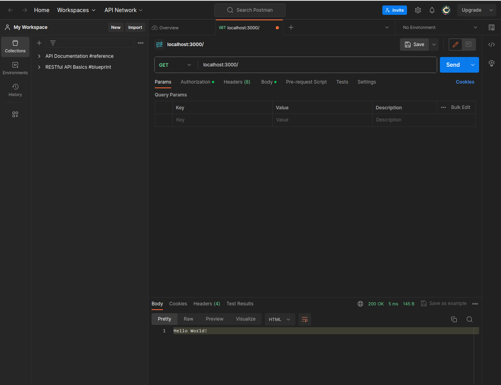
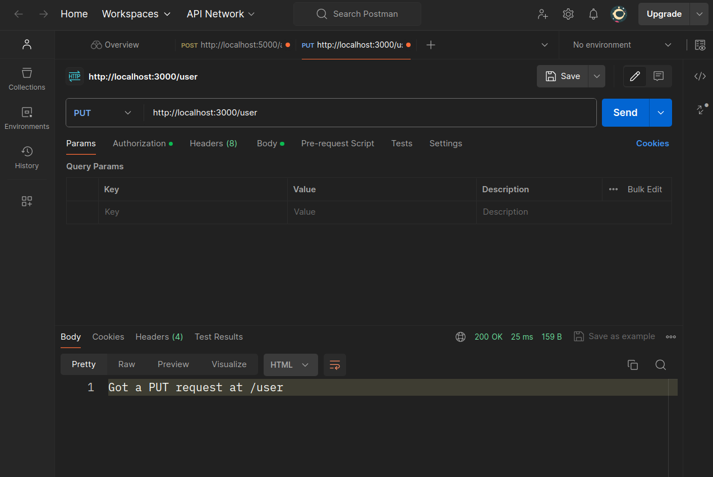

## Basic routing

**Routing** refers to determining how an application responds to
a client request to a particular endpoint, which is a URI (or
path) and a specific HTTP request method (GET, POST, and so on).

Each route can have one or more handler functions, which are
executed when the route is matched.

Route definition takes the  following structure:

```r
app$METHOD(PATH, HANDLER)
```

- `app` is an instance of ambiorix.
- `METHOD` is an [HTTP request method](https://en.wikipedia.org/wiki/Hypertext_Transfer_Protocol#Request_methods), in lowercase.
- `HANDLER` is the function executed when the route is matched.

The following examples illustrate defining simple routes.

Respond with `Hello World!` on the homepage:

```r
app$get("/", \(req, res) {
  res$send("Hello World!")
})
```

Respond to POST request on the root route (`/`), the application's home page:

```r
app$post("/", \(req, res) {
  res$send("Got a POST request")
})
```

Respond to a PUT request to the `/user` route:

```r
app$put("/user", \(req, res) {
  res$send("Got a PUT request at /user")
})
```

Respond to a DELETE request to the `/user` route:

```r
app$delete("/user", \(req, res) {
  res$send("Got a DELETE request at /user")
})
```

**NOTE:**
- Browsers issue a GET request by default. This means that if you run the [example app](./index.R) and visit localhost 3000, you'll only be able to access the homepage (`/`).
- The easiest ways to see the responses from the other routes would be to either:
    - Install [Postman](https://www.postman.com/) and make the requests from there (**Recommended**). The free tier is more than enough.
      Here is how issuing the various requests above would look like:
      
      
      
      
    - Open another R session and use [httr2](https://httr2.r-lib.org/index.html) to make requests to the endpoints.
