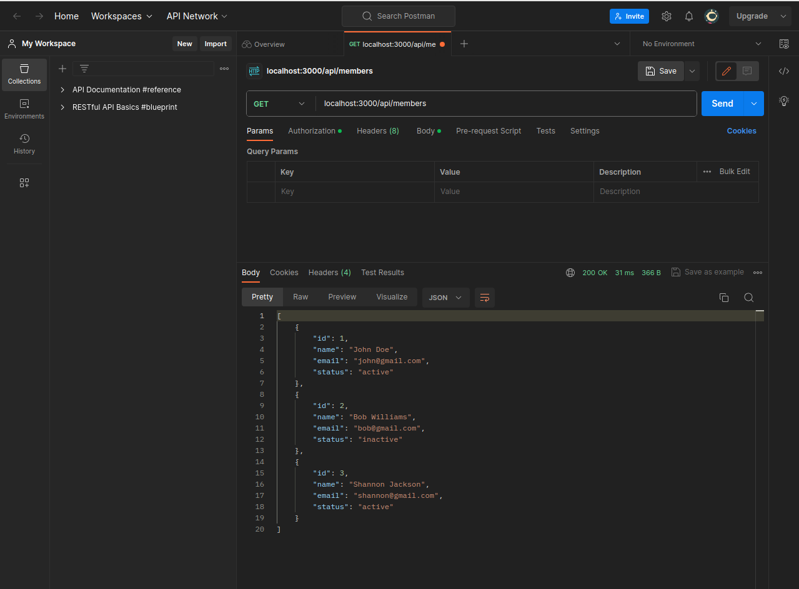
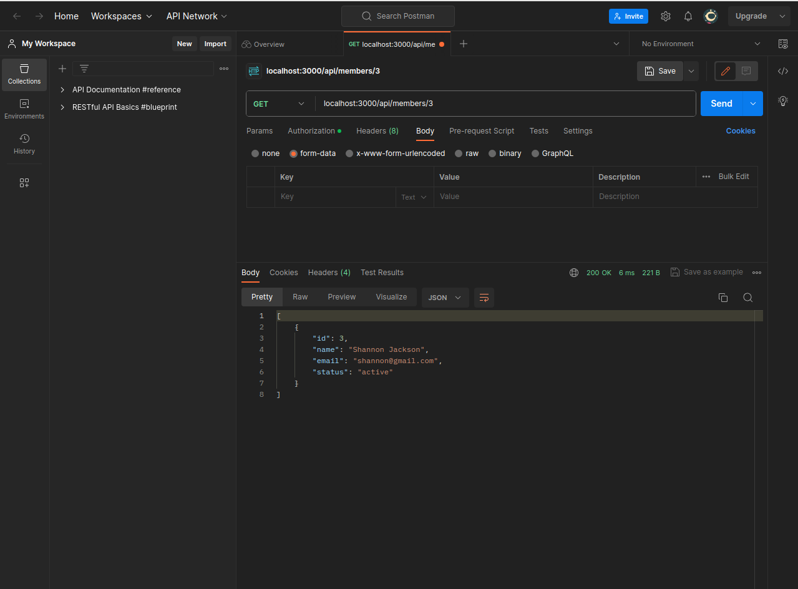

## A simple JSON API

Ideally, the backend works hand-in-hand with the database. But for the sake
of simplicity, let's hardcode a list of members:

```r
members <- data.frame(
  id = as.character(1:3),
  name = c("John Doe", "Bob Williams", "Shannon Jackson"),
  email = c("john@gmail.com", "bob@gmail.com", "shannon@gmail.com"),
  status = c("active", "inactive", "active")
)
```

You don't have to worry about converting `members` into JSON because the
`res$json()` method does it for you.

Create a GET request to get all members:

```r
app$get("/api/members", \(req, res) {
  res$json(members)
})
```



Create a GET request to get a single member by id:

```r
app$get("/api/members/:id", \(req, res) {
  # get the supplied id:
  member_id <- req$params$id

  # filter member with that id:
  found <- members |> dplyr::filter(id == member_id)

  res$json(found)
})
```



You can also dictate how the response changes if no member is found:

```r
# get a single member:
app$get("/api/members/:id", \(req, res) {
  # get the supplied id:
  member_id <- req$params$id

  # filter member with that id:
  found <- members |> dplyr::filter(id == member_id)

  # if a member with that id was found, return the member:
  if (nrow(found) > 0) {
    return(res$json(found))
  }

  # otherwise, change response status to 400 (Bad Request)
  # and provide a message:
  msg <- list(msg = sprintf("No member with the id of %s", member_id))
  res$set_status(400L)$json(msg)
})
```


A POST request to create a new member:

```r
app$post("/api/members", \(req, res) {
  # parse form-data:
  body <- parse_multipart(req)

  # details of the new member:
  new_member <- data.frame(
    id = uuid::UUIDgenerate(),
    name = body$name,
    email = body$email,
    status = body$status
  )

  # save new member:
  members <<- dplyr::bind_rows(members, new_member)

  # respond with a message and details of the newly created member:
  response <- list(
    msg = "Member created successfully!",
    member = new_member
  )

  res$json(response)
})
```


You can of course ensure all the details are sent (name, email & status) before
creating the new member:

```r
app$post("/api/members", \(req, res) {
  # parse form-data:
  body <- parse_multipart(req)

  name <- body$name
  email <- body$email
  status <- body$status

  # require all member details:
  if (is.null(name) || is.null(email) || is.null(status)) {
    msg <- list(msg = "Please include a name, email & status")
    return(res$set_status(400L)$json(msg))
  }

  # details of the new member:
  new_member <- data.frame(
    id = uuid::UUIDgenerate(),
    name = name,
    email = email,
    status = status
  )

  # save new member:
  members <<- dplyr::bind_rows(members, new_member)

  # respond with a message and details of the newly created member:
  response <- list(
    msg = "Member created successfully!",
    member = new_member
  )

  res$json(response)
})
```


Create a PUT request to update a member:

```r
app$put("/api/members/:id", \(req, res) {
  # get the supplied id:
  member_id <- req$params$id

  # filter member with that id:
  found <- members |> dplyr::filter(id == member_id)

  # if a member with that id is NOT found, change response status
  # and provide a message:
  if (nrow(found) == 0) {
    msg <- list(msg = sprintf("No member with the id of %s", member_id))
    return(res$set_status(400L)$json(msg))
  }

  # otherwise, proceed to update member:
  body <- parse_multipart(req)

  # only update provided fields:
  found$name <- body$name %||% found$name
  found$email <- body$email %||% found$email
  found$status <- body$status %||% found$status

  members[members$id == found$id, ] <- found

  response <- list(
    msg = "Member updated successfully",
    member = found
  )
  res$json(response)
})
```


Create a delete request to, well, delete a member:

```r
app$delete("/api/members/:id", \(req, res) {
  # get the supplied id:
  member_id <- req$params$id

  # filter member with that id:
  found <- members |> dplyr::filter(id == member_id)

  # if a member with that id is NOT found, change response status
  # and provide a message:
  if (nrow(found) == 0) {
    msg <- list(msg = sprintf("No member with the id of %s", member_id))
    return(res$set_status(400L)$json(msg))
  }

  # otherwise, proceed to delete member:
  members <<- members |> dplyr::filter(id != member_id)

  response <- list(
    msg = "Member deleted successfully",
    members = members
  )
  res$json(response)
})
```

