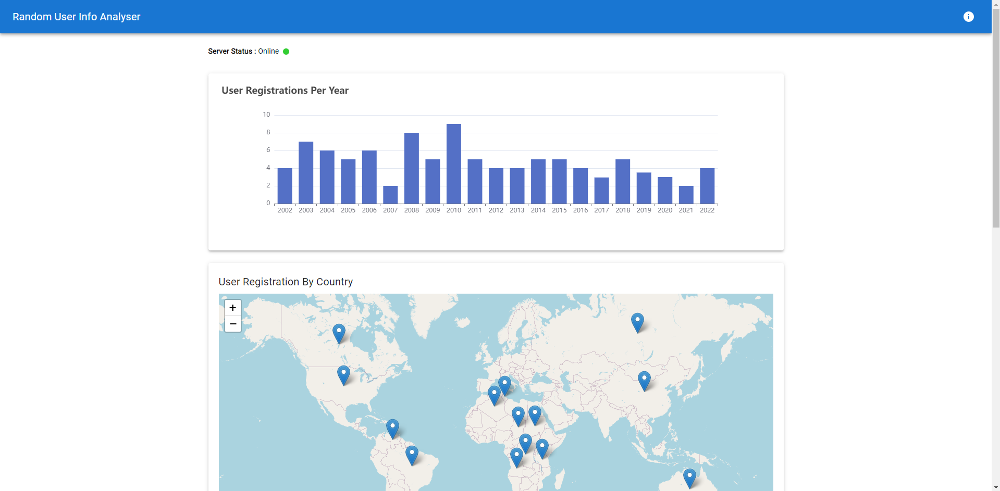

Random User Info Analyzer Web App

This is a web application that displays random user information retrieved from a PostgreSQL database. The backend is developed using R with the <a href="https://ambiorix.dev" target="_blank">Ambiorix</a>
and the frontend is built with React.

## Overview

The application fetches random user data from the Random User API every 10 seconds and stores it in a PostgreSQL database. The frontend periodically retrieves the stored data from the backend server and displays count of people registered in a year.



## Prerequisites

Before running the project, ensure that you have the following installed:

- R (v4.0 or above)
- Node.js (v12 or above)
- PostgreSQL database

## Getting Started

### Backend Setup

1. **Configure the database connection:**
   - Open the `config.yaml` file located in the `backend` directory.
   - Update the database configuration settings according to your PostgreSQL setup.

2. **Install the required R packages:**
   - Open an R terminal and run the following command:
     ```R
     install.packages(c("ambiorix", "httr", "RPostgres", "jsonlite", "DBI", "httpuv", "future", "coro"))
     ```

3. **Start the backend server:**
   - In the R terminal, navigate to the `backend` directory.
   - Run the following command:
     ```R
     Rscript app.R
     ```
   - The backend server will start running on `http://127.0.0.1:1000`.

   **Note:** The necessary database tables will be created automatically when the backend server starts.

### Frontend Setup

1. **Install the required dependencies:**
   - Open a terminal and navigate to the `frontend/my-app` directory.
   - Run the following command to install the dependencies:
     ```bash
     npm install
     ```

2. **Start the frontend development server:**
   - In the terminal, run the following command:
     ```bash
     npm start
     ```
   - The frontend application will be accessible at `http://localhost:3000`.

## How It Works

1. The backend server periodically fetches random user data from the Random User API every 10 seconds.
2. The fetched data is stored in the PostgreSQL database.
3. The frontend application sends requests to the backend server every 10 seconds to retrieve the stored user data.
4. The retrieved data is displayed in a tabular format along witha a bar chart in the frontend application.


## Technologies Used

**Backend:**

- R
- Ambiorix (web framework)
- PostgreSQL (database)

**Frontend:**
- React


